# Top 50 System Design Interview Questions — Full Answers + Diagrams

> Consolidated from the original 50-question set (5 image pages), numbering 1–50 kept as-is.
> Each question has a full answer (not just bullet points) and a Mermaid diagram replacing the original illustration.
> The **ADDITIONS (51–70)** section at the end covers practical gaps not in the original set.

---

## I. FOUNDATIONAL CONCEPTS (1–10)

### 1. What is System Design?

The process of designing large-scale, reliable, efficient, and maintainable systems to meet both functional and non-functional requirements.

> **Goal:** design a system that is scalable, reliable, always available, and cost-optimized.

### 2. Functional vs Non-Functional Requirements?

- **Functional:** describes what the system *does*. E.g. login, file upload.
- **Non-Functional:** describes how well the system *performs*. E.g. Scalability, Availability, Security.

| Functional | Non-Functional |
|---|---|
| Features | Performance |
| Behavior | Scalability |
| Business logic | Availability |
| | Security |

### 3. What is Scalability?

The system's ability to handle increasing workload by adding more resources.

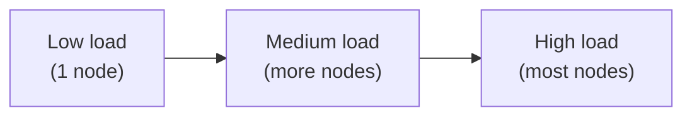

Two directions: **Scale Up** (vertical) vs **Scale Out** (horizontal).

### 4. Horizontal vs Vertical Scaling?

- **Vertical Scaling (Scale Up):** increase the power (CPU, RAM) of the existing machine.
- **Horizontal Scaling (Scale Out):** add more machines to distribute the load.

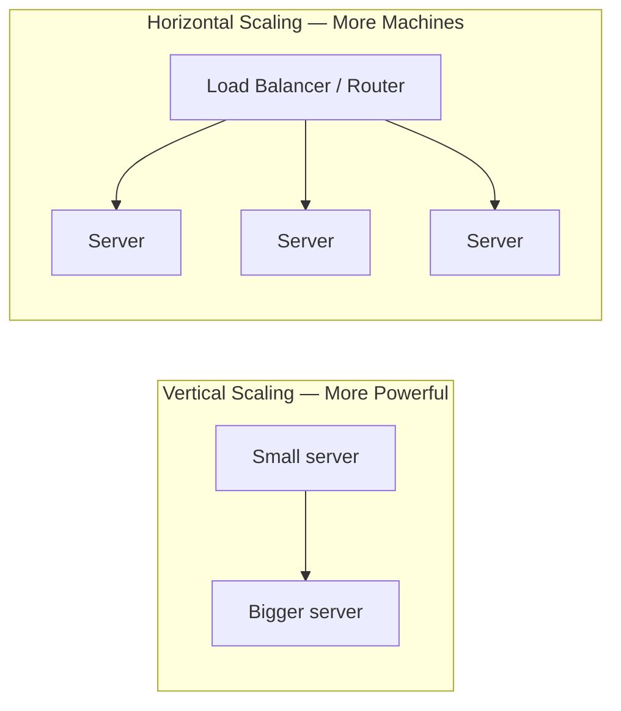

### 5. Load Balancer?

Distributes incoming network traffic across multiple servers, ensuring no single server is overloaded.

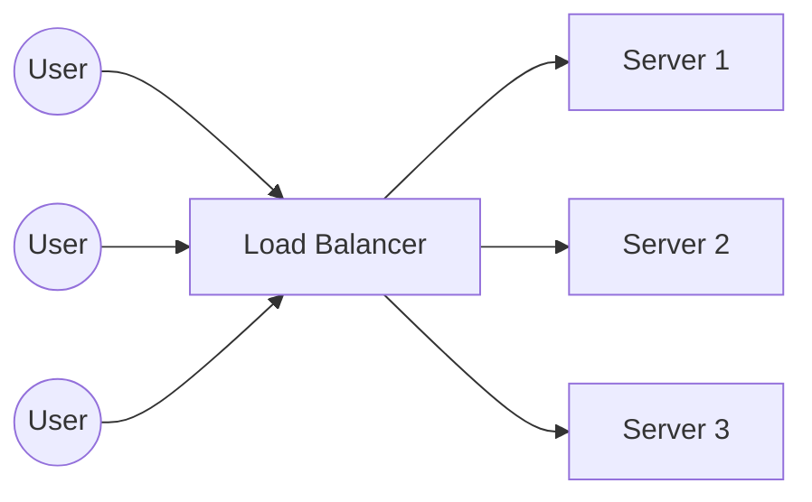

**Benefits:** High Availability, better performance, Fault Tolerance.

### 6. Reverse Proxy?

A server that sits in front of backend servers, forwarding client requests to them and returning the response back to the client.

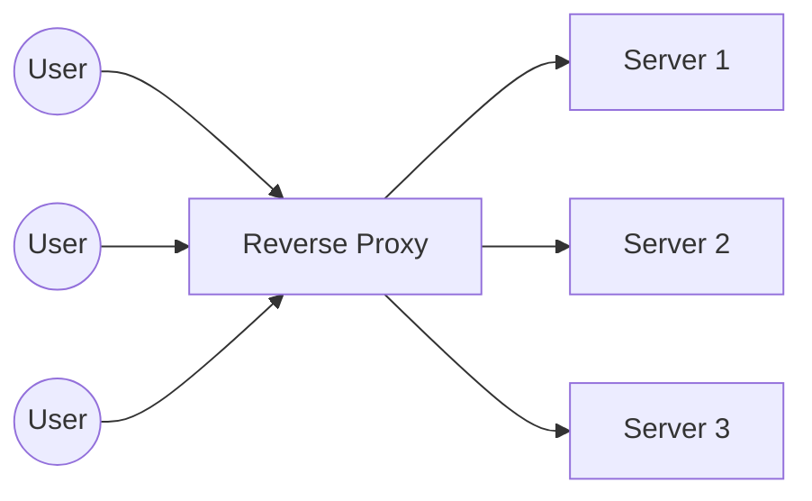

**Benefits:** Security, Caching, Compression, SSL Termination.

### 7. API Gateway?

A single entry point for all client requests, responsible for routing them to the correct service.

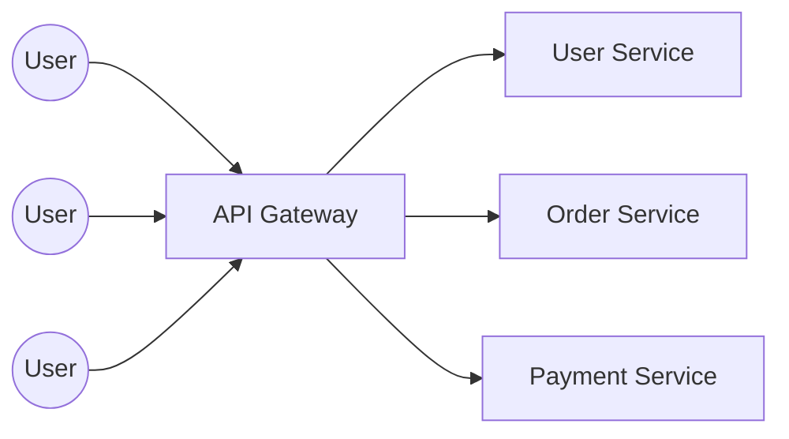

**Benefits:** Routing, Authentication, Rate Limiting, Monitoring.

### 8. Monolith vs Microservices?

- **Monolith:** a single codebase, deployed as one unit.
- **Microservices:** an application split into multiple independent services.

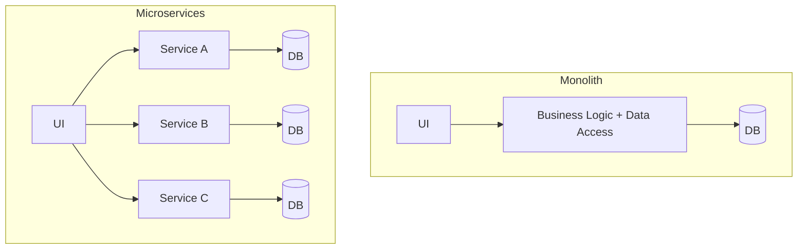

### 9. High Availability?

A system that keeps running continuously over a very long period with near-zero downtime.

> Achieved via: Redundancy, Failover, Load Balancing, Replicas, multi-Data-Center deployment...

### 10. Fault Tolerance?

A system that continues to operate correctly even when some internal components fail.

> Achieved via: Replication, Retry Mechanism, Circuit Breaker, graceful degradation design...

---

## II. DATABASE & STORAGE (11–20)

### 11. SQL vs NoSQL?

| SQL | NoSQL |
|---|---|
| Relational (table-based) | Non-relational (Key-Value, Document, Column) |
| Fixed schema | Flexible schema |
| ACID compliant | BASE (Eventually Consistent) |
| Vertical scaling | Horizontal scaling |
| E.g. MySQL, PostgreSQL | E.g. MongoDB, Cassandra, DynamoDB, Redis |

> **Why it matters:** helps you choose the right database type based on use case, scaling needs, and required data consistency level.

### 12. Database Indexing?

An index is a data structure that speeds up data retrieval. Types: Primary Index, Secondary Index, Clustered Index, Non-Clustered Index.

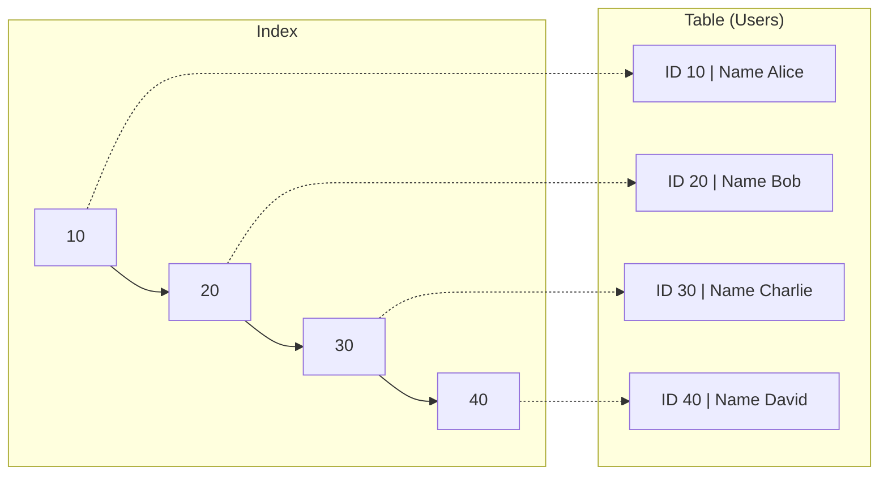

> **Why it matters:** speeds up search queries but slows down writes. Indexing wisely is key to performance.

### 13. Database Replication?

Copying data from one database to another to improve availability and read performance. Types: Master-Slave, Master-Master.

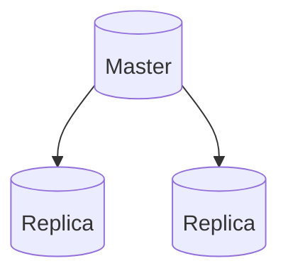

> **Why it matters:** provides high availability and fault tolerance. Read traffic can be offloaded to replicas.

### 14. Database Sharding?

Splitting one large database into multiple smaller, independent pieces called shards. Each shard lives on a separate server.

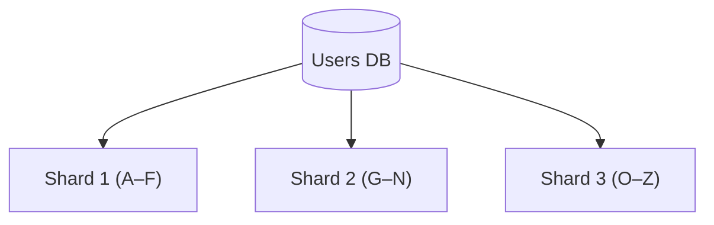

> **Why it matters:** enables horizontal scaling by distributing data across multiple servers.

### 15. Partitioning vs Sharding?

- **Partitioning:** splitting one table into smaller pieces **within the same database/server**.
- **Sharding:** splitting data across **multiple different databases/servers**.

> **Why it matters:** Partitioning scales within a single DB. Sharding scales across multiple DBs.

### 16. Read Replicas?

Copies of the primary database, used exclusively for read operations. Useful for scaling read-heavy applications.

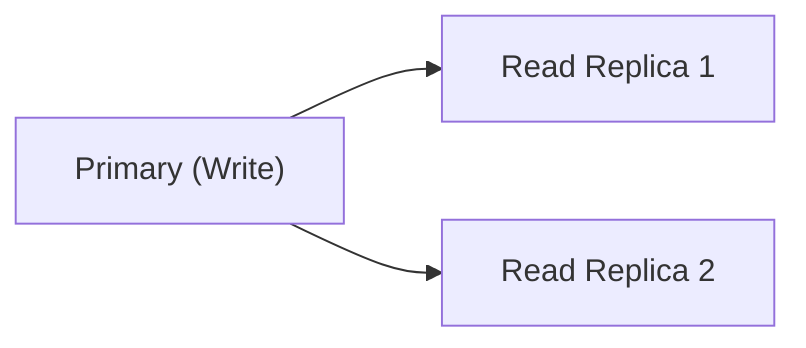

> **Why it matters:** improves read performance and reduces load on the primary database.

### 17. CAP Theorem?

A distributed system can achieve at most **2 out of 3** of the following:

- **C — Consistency**
- **A — Availability**
- **P — Partition Tolerance**

> **Why it matters:** helps you understand the trade-offs when designing distributed systems.

### 18. ACID vs BASE?

| ACID (SQL) | BASE (NoSQL) |
|---|---|
| Atomicity | Basically Available |
| Consistency | Soft State |
| Isolation | Eventually Consistent |
| Durability | |

> **Why it matters:** ACID guarantees reliability for relational DBs. BASE is used in NoSQL to achieve high availability and scalability.

### 19. Eventual Consistency?

The system will become consistent after some period of time, rather than being immediately consistent. Very common in distributed systems.

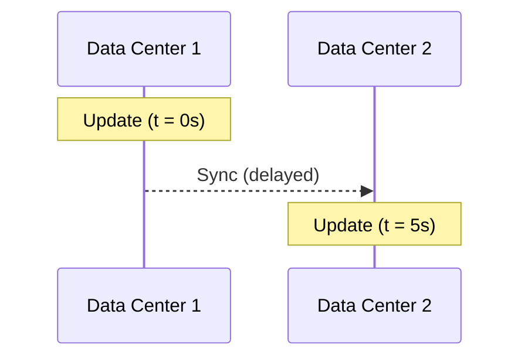

> **Why it matters:** provides high availability by accepting temporarily inconsistent data.

### 20. Normalization vs Denormalization?

- **Normalization:** splitting data into multiple tables to eliminate duplication — faster writes, more JOINs on read.
- **Denormalization:** intentionally duplicating data to reduce JOINs — faster reads, more storage and harder to keep in sync.

> **Why it matters:** demonstrates the ability to balance data integrity against read performance when designing a schema.

---

## III. PERFORMANCE & CACHING (21–30)

### 21. What is Caching?

Storing frequently accessed data in memory so subsequent requests are served faster. Reduces latency and database load.

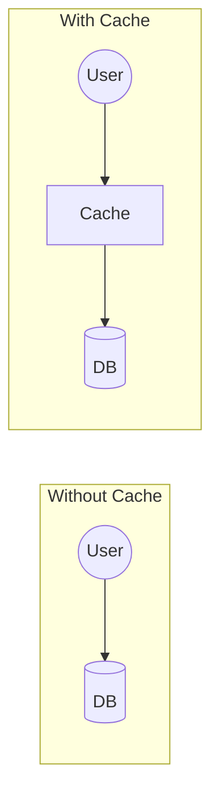

> **Why it matters:** improves response time, reduces database load, and increases scalability.

### 22. Cache-Aside Pattern?

The application looks up data in the cache first. On a miss, it fetches from the DB, writes it into the cache, then returns it to the user. The most common caching strategy.

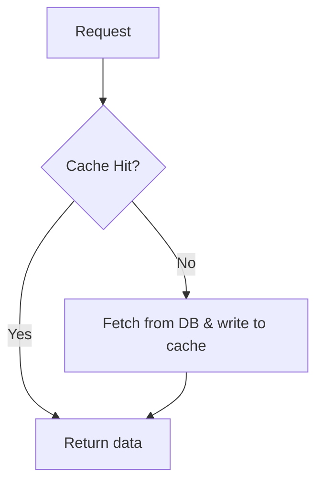

> **Why it matters:** keeps data fresh and reduces unnecessary database queries.

### 23. Write Through vs Write Back?

- **Write Through:** writes to cache and DB **simultaneously**. Safer, but slower.
- **Write Back:** writes to cache first, DB is updated later. Faster, but carries data-loss risk.

> **Why it matters:** helps you pick the right caching strategy based on the consistency-vs-performance trade-off.

### 24. What is Redis?

An in-memory data store used as a database, cache, and message broker. Supports strings, hashes, lists, sets, sorted sets...

**Real-world uses:** Caching, session storage, leaderboards, rate limiting, real-time analytics.

> **Why it matters:** Redis is extremely fast and a critical building block for high-performance systems.

### 25. What is a CDN?

Content Delivery Network — a network that distributes content to servers in multiple geographic locations. Delivers content to users faster.

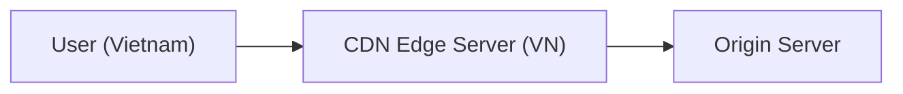

> **Why it matters:** reduces latency, speeds up page loads, and handles high traffic volumes.

### 26. What is Rate Limiting?

Limits the number of requests a user can send within a given time window. Prevents abuse and protects the system from overload.

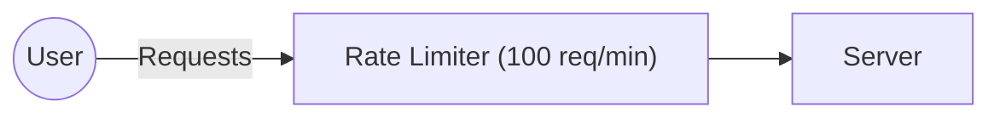

> **Why it matters:** protects the API from abuse and ensures fair resource sharing.

### 27. What is a Message Queue?

A queue that holds messages between services, enabling asynchronous communication. Reduces coupling and smooths out traffic spikes.

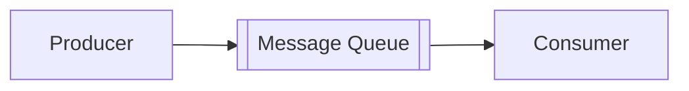

> **Why it matters:** improves performance, reliability, and reduces tight coupling between components.

### 28. Kafka vs RabbitMQ?

| Criteria | Kafka | RabbitMQ |
|---|---|---|
| Nature | Distributed Commit Log | Message Broker |
| Model | Publish / Subscribe | Queue (Point to Point) |
| Storage | Disk-based, high throughput | In-memory, flexible |
| Performance | Very high | Medium |
| Use case | Event Streaming, Analytics | Task Queue, Workflow |

> **Why it matters:** helps you choose the right messaging system based on use case and requirements.

### 29. What is Idempotency?

Ensures that multiple identical requests produce the same result as sending just one request.

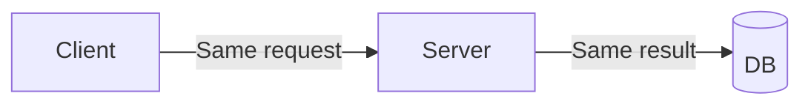

> **Why it matters:** prevents duplicated operations, e.g. charging a customer twice for one payment.

### 30. What is a Bloom Filter?

A probabilistic data structure that quickly answers "does this element **definitely not** exist, or **might** exist?". Very memory-efficient; has false positives but never false negatives.

> **Why it matters:** avoids wasted database queries when the data is guaranteed not to exist.

---

## IV. DISTRIBUTED SYSTEMS (31–40)

### 31. What is Consistent Hashing?

A hashing technique used in distributed systems to spread data across multiple servers. Minimizes the amount of data that must move when nodes are added or removed.

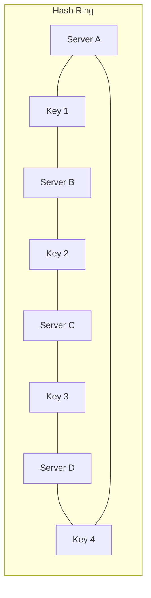

> **Why it matters:** ensures data is evenly distributed and reduces rebalancing when the number of servers changes.

### 32. What is Leader Election?

The process of selecting a single node as the leader among many nodes in a distributed system. Ensures coordination and consistency.

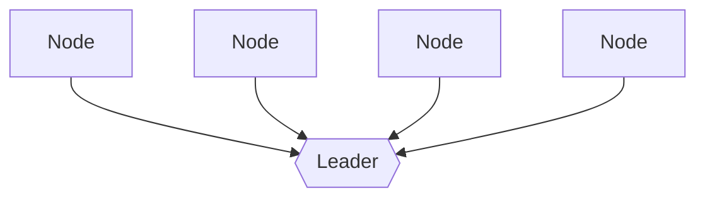

> **Why it matters:** necessary for coordination, failover handling, and avoiding conflicts between nodes.

### 33. What is a Distributed Lock?

A lock that operates across multiple processes/servers. Ensures only one process can access a shared resource at any given time.

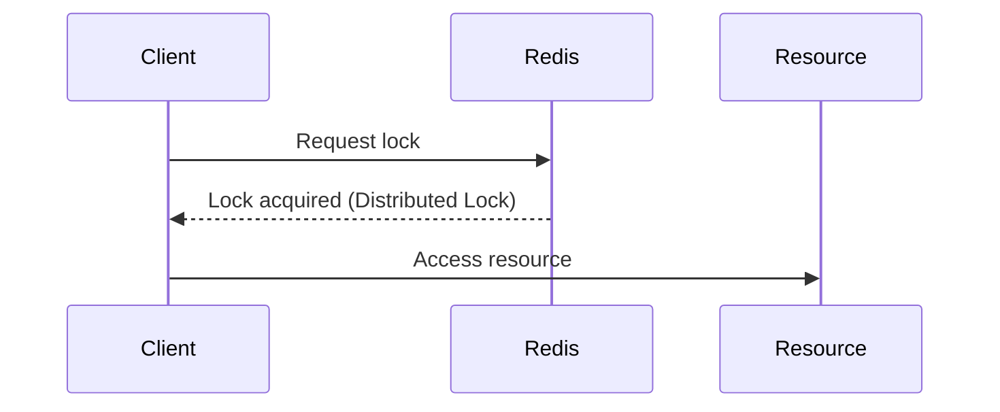

> **Why it matters:** prevents race conditions in distributed environments, e.g. when processing payments.

### 34. What is a Circuit Breaker?

Prevents a system from repeatedly calling operations that are likely to fail. Has 3 states: Closed, Open, Half-Open.

```mermaid
stateDiagram-v2
    Closed --> Open: Error threshold exceeded
    Open --> HalfOpen: After timeout
    HalfOpen --> Closed: Success
    HalfOpen --> Open: Failure
    Closed: Closed (requests pass through)
    Open: Open (requests blocked)
    HalfOpen: Half-Open (trial request)
```

> **Why it matters:** increases stability and prevents cascading failures.

### 35. What is Retry Mechanism?

Automatically retrying a failed operation after a waiting period. Should be used with exponential backoff.

```mermaid
flowchart LR
    R[Request] --> L[Error] --> R1["Retry 1 (wait 1s)"] --> R2["Retry 2 (wait 2s)"] --> R3["Retry 3 (wait 4s)"] --> OK[OK]
```

> **Why it matters:** handles transient errors and improves system reliability.

### 36. What is the Saga Pattern?

Used to manage transactions spanning multiple microservices. Consists of a chain of local transactions each paired with a compensating transaction.

```mermaid
flowchart LR
    SA[Service A] --> SB[Service B] --> SC[Service C] --> OK[Success]
    SA -.failure.-> BA["Compensate A"]
    SB -.failure.-> BB["Compensate B"]
    SC -.failure, no compensation needed.-> X[ ]
```

> **Why it matters:** maintains data consistency across services without needing 2PC.

### 37. What is Event-Driven Architecture?

Components communicate with each other through events. Producers emit events, consumers react to them.

```mermaid
flowchart LR
    EP["Event Producer"] -->|Emits event| EB["Event Bus (Kafka/RabbitMQ)"] -->|Receives event| EC["Event Consumer"]
```

> **Why it matters:** scales very well, keeps components loosely coupled, and enables real-time processing.

### 38. What are WebSockets?

A protocol enabling two-way (full-duplex) communication over a single TCP connection. Ideal for real-time applications.

```mermaid
sequenceDiagram
    participant C as Client
    participant S as Server
    C->>S: Handshake (HTTP)
    Note over C,S: Connection stays open until closed
    C->>S: Two-way communication
    S->>C: Two-way communication
```

> **Why it matters:** enables real-time features like chat, live updates, and online games.

### 39. Long Polling vs WebSockets?

| Criteria | Long Polling | WebSockets |
|---|---|---|
| Connection | Repeated HTTP requests | Persistent, stays open |
| Communication | Server replies when data is available | Two-way, real-time |
| Latency | Higher | Lower |

> **Why it matters:** helps you pick the right communication method for each real-time use case.

### 40. What is Service Discovery?

A mechanism that lets services find each other's addresses without hard-coding IPs. Two common types: client-side (Eureka) and server-side (via load balancer). Tools: Consul, etcd, Kubernetes DNS.

> **Why it matters:** necessary when instances are constantly scaled up/down and addresses keep changing.

---

## V. SYSTEM DESIGN PROBLEMS (REAL-WORLD SYSTEMS) (41–50)

### 41. Design a URL Shortener

- Shorten a long URL into a unique short code.
- Redirect from the short URL back to the original URL.
- Handle heavy read traffic, store billions of URLs.

```mermaid
flowchart LR
    U((User)) --> WS["Web Server"] --> SC["Generate short code"] --> DB[("Database (URLs)")]
    SC -.-> RS["Redirect Service"]
```

> **Why it matters:** tests understanding of hashing, ID generation, redirects, and scalability.

### 42. Design WhatsApp (a chat system)

- 1-on-1 and group messaging in real time.
- Message delivery, online status, and notifications.
- Scale to billions of users.

```mermaid
flowchart LR
    UA((User A)) --> API["API Server"] --> MQ[["Message Queue (Kafka)"]] --> DS["Delivery Service"] --> UB((User B))
    API -.-> DB[("Database (Messages)")]
```

> **Why it matters:** covers real-time systems, messaging, scaling, and data consistency.

### 43. Design Instagram Feed

- Display a personalized feed of photos, videos, reels.
- Handle millions of posts and very high read traffic.

```mermaid
flowchart LR
    U((User)) --> FS["Feed Service"] --> Cache["Cache (Redis)"] --> DB[("DB (Posts)")]
    FS -.-> MS["Media Storage (S3)"]
    FS -.-> CR["Content Ranking Service"]
```

> **Why it matters:** tests feed ranking, caching, content distribution, and scalability.

### 44. Design YouTube

- Upload, store, process, and stream video.
- Handle metadata, search, likes, comments, recommendations.
- Distribute high-quality video at massive scale.

```mermaid
flowchart LR
    U((User)) --> UP["Upload Service"] --> TC["Video Processing (Transcoding)"] --> CDN --> U2((User))
    UP -.-> MDB[("Metadata DB (Videos, Users)")]
```

> **Why it matters:** covers video processing, CDN, storage, search, and large-scale problems.

### 45. Design Netflix

- Stream movies and TV shows to users.
- Content recommendations, multiple devices, offline downloads.
- Global scale with high availability.

```mermaid
flowchart LR
    U((User)) --> GW["API Gateway"] --> Rec["Recommendation Service"] --> UP["User Profile Service"]
    GW -.-> CDN
    GW -.-> VS["Video Storage (S3)"]
    GW -.-> MDB[("Metadata DB (Shows, Users)")]
```

> **Why it matters:** tests streaming architecture, recommendation systems, caching, and global distribution.

### 46. Design Uber

- Ride booking, driver matching, real-time trip tracking, payments.
- Handle continuous location updates at high concurrency.

```mermaid
flowchart LR
    RA["Rider App"] --> AS["API Server"] --> MS["Matching Service"] --> DA["Driver App"]
    AS -.-> GDB[("Geo DB (real-time locations)")]
```

> **Why it matters:** tests geo-distributed systems, real-time data, matching algorithms, and scaling.

### 47. Design a Notification System

- Send notifications via push, email, SMS, in-app.
- Handle large volume and retry mechanisms.
- Support scheduled sends and templates.

```mermaid
flowchart LR
    C["Client (App/Web)"] --> NA["Notification API"] --> MQ[["Message Queue"]] --> NW["Notification Worker"]
    NW --> Push["Push"] & Email["Email"] & SMS["SMS"] & InApp["In-App"]
    NA -.-> TDB[("Template DB")]
```

> **Why it matters:** covers reliability, retry mechanisms, multi-channel delivery, and scalability.

### 48. Design a Payment Gateway

- Secure payments, multiple payment methods, refunds, transaction history.
- Ensure reliability and consistency.

```mermaid
flowchart LR
    C[Client] --> GW["API Gateway"] --> PS["Payment Service"] --> Bank["Bank / PSP (third party)"]
    PS -.-> TDB[("Transaction DB")]
```

> **Why it matters:** tests security, reliability, transaction processing, and third-party integration.

### 49. Design a Real-Time Chat App

- Real-time messaging, group chat, "typing" indicator, delivery status.
- Store messages and re-sync when the user comes back online.

```mermaid
flowchart LR
    CA["Client A"] --> WS1["WebSocket Server"] --> MQ[["Message Queue"]] --> WS2["WebSocket Server"] --> CB["Client B"]
    WS1 -.-> MDB[("Message DB (chat history)")]
```

> **Why it matters:** tests real-time communication, WebSockets, presence, and message reliability.

### 50. Design a Distributed Rate Limiter

- Limit requests per user/API key across multiple servers at once.
- Common algorithms: Token Bucket, Leaky Bucket, Sliding Window Log/Counter. Usually backed by Redis as a shared counter.

```mermaid
flowchart LR
    U((User)) --> S1["Server 1"] & S2["Server 2"] & S3["Server 3"]
    S1 & S2 & S3 --> RC[("Redis — shared counter")]
```

> **Why it matters:** tests shared-state management, concurrency handling, and latency optimization.

---

## ADDITIONS — Gaps to Cover for Practical Readiness

The original 50 questions lean heavily toward **concepts/terminology**. When you actually build a NestJS/Postgres service under real load, you'll run into a whole set of issues the original set never mentions. Grouped under the same 5 categories above.

### I. Foundations (additions)

**51. Back-of-envelope estimation** — how to estimate QPS, storage, and bandwidth from a problem's given numbers (how many users, how many requests/user/day...). Example: 10 million users, 5% online at peak, each sending 2 requests/minute → QPS ≈ (10,000,000 × 0.05 × 2) / 60 ≈ 16,700 req/s.

**52. Health Check & Readiness/Liveness Probe** — why a load balancer/Kubernetes needs to distinguish "the app is alive" (liveness) from "the app is ready to receive traffic" (readiness). An app can be alive but not yet connected to the DB — it shouldn't receive traffic yet.

**53. Graceful Shutdown** — handling the SIGTERM signal, draining in-flight connections before a container is killed, to avoid dropping requests during deploys/scale-downs.

### II. Database (additions)

**54. N+1 Query Problem** — why ORMs (TypeORM) commonly fall into this (loading a list, then looping a relational query per item), how to detect it (query-count logging), and how to fix it (eager loading, `relations`, DataLoader).

**55. Pagination: Offset vs Keyset (Cursor-based)** — why `OFFSET 100000` gets slower as data grows (the DB still has to scan through the 100,000 skipped rows). Cursor pagination uses the last-seen column value (`WHERE id > :lastId`) to avoid this.

**56. Transaction Isolation Levels** — Read Committed, Repeatable Read, Serializable; what dirty read, non-repeatable read, and phantom read mean, and which level blocks which phenomenon.

**57. Optimistic Lock vs Pessimistic Lock** — a `version` column (check the version on update, retry on mismatch) vs `SELECT ... FOR UPDATE` (lock the row immediately on read). Optimistic suits low-conflict scenarios; pessimistic suits high-conflict ones (e.g. flash sales).

**58. Connection Pooling** — why a pool that's too large (contention at the DB from too many connections competing for CPU/locks) or too small (requests queue up waiting) both cause problems. PgBouncer acts as a connection-pooling proxy in front of the app.

### III. Performance & Caching (additions)

**59. Cache Stampede / Thundering Herd** — many requests hammering the DB simultaneously when a hot cache key expires at the same moment. Mitigations: locking (only one request queries the DB, others wait), TTL jitter (randomize expiry times), stale-while-revalidate (serve stale data while refreshing in the background).

```mermaid
sequenceDiagram
    participant R1 as Request 1..N
    participant Cache
    participant DB
    Note over Cache: Key expires simultaneously
    R1->>Cache: GET key (miss)
    Note over R1,DB: No lock → N requests hit the DB at once
    R1->>DB: N concurrent queries
```

**60. Outbox Pattern** — ensures writing to the DB and publishing an event is atomic (within a single transaction), preventing lost events when a service crashes mid-flow. An `outbox` table stores events to be sent; a relay process reads and publishes them, then marks them as sent.

```mermaid
flowchart LR
    App -->|1 transaction| DB[("DB: order + outbox row")]
    Relay["Outbox Relay"] -->|reads| DB
    Relay -->|publishes| MQ[["Message Queue"]]
```

**61. Backpressure** — what a system should do when consumers process slower than producers, to avoid an unbounded queue (limiting concurrency, limiting queue size, rejecting or delaying the producer).

### IV. Distributed Systems (additions)

**62. Two-Phase Commit (2PC) vs Saga** — 2PC locks resources across all participating services until everyone agrees to commit → poor fit for microservices due to high latency, and one stuck service locks everything. Saga trades that off: it accepts a temporarily inconsistent state and compensates on failure instead of locking upfront.

**63. CQRS (Command Query Responsibility Segregation)** — splitting the write model (Command) and read model (Query) into two separate paths, typically used when reads and writes have very different scaling needs. Not something to default to — it adds significant complexity.

**64. Idempotency Key in Practice** — designing an `idempotency_keys` table (key, request_hash, response, expires_at), applied to payment/booking APIs to prevent client retries from creating duplicates.

**65. Observability: Logging, Metrics, Tracing (the 3 pillars)** — structured logs (JSON, with a `traceId`), metrics (Prometheus: latency, error rate, throughput), tracing (following a single request across multiple services). Missing any one of the three creates a blind spot when debugging production.

### V. System Design & Operations (additions)

**66. API Design & Versioning** — REST vs GraphQL vs gRPC (when to pick which: REST for simple and common cases, GraphQL when clients need flexible field selection, gRPC for high-performance internal service-to-service calls). Versioning APIs (`/v1`, `/v2`) so old clients don't break.

**67. Authentication & Authorization at Scale** — JWT (stateless, self-contained) vs Session (stateful, stored server-side/Redis), refresh tokens, basic OAuth2 flow.

**68. Blue-Green Deployment vs Canary Release** — Blue-Green: run two environments in parallel, cut traffic over instantly, instant rollback. Canary: shift traffic gradually (5% → 50% → 100%), catching issues early with lower risk.

**69. Chaos Engineering / Testing Resilience** — deliberately breaking the system (killing containers, cutting network, injecting fake latency) to verify that circuit breakers/retries/outbox actually work, not just in theory.

**70. Multi-Region & Geo-Replication** — the latency-vs-consistency trade-off when users are spread across geographic regions. Write to the nearest region, sync across regions later (eventual consistency), or accept higher latency to keep strong consistency.

---

**Note:** Questions 51–70 don't replace 1–50 — they fill the gap between "knowing the definition" and "having actually caused a bug yourself and fixed it." Most senior-level interview questions actually circle around items 54, 56, 57, 59, 60, 64, 65 more than the general concepts in Section I.
